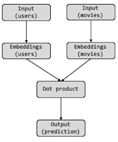
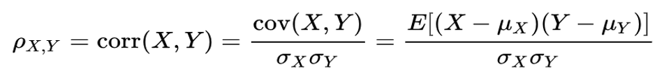

```{r setup, include=FALSE}
knitr::opts_chunk$set(echo = TRUE,  fig.align = "center", out.width = "80%")
options(scipen = 99)
```


<style>
body {
text-align: justify}
</style>

# Objectives

In this project, we aim to implement a proper movie recommendation system for customers using the data frame provided by netflix back in 2005 for its prize competition. Here, we will supplement suitable data pre-processing methods, data explorations, and data visualizations to ultimately aid the readers of this report in understanding the work-flow of our project, which finally leads to the development of our models, complemented with various error analysis, and suggestions for improvements.

# Libraries

Firstly, we import some of the necessary packages for the development of our project and deployment of suitable models.

```{r library, message=FALSE}
library(tidyverse)
library(ggplot2)
library(plotly)
library(glue)
library(scales)
library(recommenderlab)
library(dplyr)
library(recosystem)
library(tensorflow)
library(keras)
library(reticulate)
```

```{r}
reticulate::conda_list()
```

```{r}
use_condaenv("anaconda3", required = TRUE)
```

# Data Pre-processing

The following code chunk is run in python. The purpose is to combine all the txt data into one large file, perform data cleansing, and integrate the movie_id into the dataset. This process will also remove all the lines containing missing values (i.e. the rows which is addressed for the movie_id). It will be executed if the stipulated data is not present in the specified directory.
```{python}
import os
from datetime import datetime
start = datetime.now()
if not os.path.isfile('./data_input/data.csv'):
    #read all txt file and store them in one big file
    data = open('./data_input/data.csv', mode='w')
    
    row = list()
    files = ['./data_input/combined_data_1.txt', './data_input/combined_data_2.txt',
            './data_input/combined_data_3.txt', './data_input/combined_data_4.txt']
    for file in files:
        print('reading ratings from {}...'.format(file))
        with open(file) as f:
            for line in f:
                del row[:]
                line = line.strip()
                if line.endswith(':'):
                    #all are rating
                    movid_id = line.replace(':', '')
                else:
                    row = [x for x in line.split(',')]
                    row.insert(0, movid_id)
                    data.write(','.join(row))
                    data.write('\n')
        print('Done.\n')
    data.close()
print('time taken:', datetime.now() - start)
```


In this section, we will re-read the data into our IDE (i.e. in our case, to RStudio). 

```{r , echo=FALSE}
data <- read.csv("data_input/data.csv", header = FALSE)
```

In this second section, we are trying better understand the current state of our data, and determine whether we would need to further transform our data due to underlying problems such as redundant data, out of range values, etc.

Here, we call the head function to get a sense of how our data looks like.
```{r}
data <- read.csv("data_input/data.csv", header = FALSE)
data %>% head()
```

After observing the above head data, we can deduce that the column names and some of the data types (i.e date is not in date format) of the data are still not suitable, and would require transformation of column names and column data type to the appropriate ones before it is ready to be utilized further.
```{r}
data <- data %>% rename(movie_id = V1,
                        customer_id = V2,
                        rating = V3,
                        date = V4
                        ) %>% 
  mutate(date = as.Date(date))

data %>% head()
```

Here, we check the number of movies inside our data.
```{r}
length(unique(data$movie_id))
```

Here, we obtain the amount of unique customer ids in our data.
```{r}
length(unique(data$customer_id))
```

Here, we are trying to see the dimension of our data frame, or also commonly known as the shape of our data frame. In this case, we can see the below figures indicating 100480507 rows along with 4 columns.
```{r}
dim(data)
```

Here, we can see the levels in which users gave rating towards the movies by applying the label encoding method towards the rating column in our data frame using its own rating as label with factor function in r. The results are the different unique values of the rating users have given. It turns out that all the ratings given are as expected (no out of bound values), ranging from 1 to 5.
```{r}
levels(as.factor(data$rating))
```

Below, we check whether there would be any need for further processing due to missing value in the columns. By observing the results below, our current data frame does not have any missing value as it has been previously handled in our jupyter notebook file before being imported here.
```{r}
colSums(is.na(data))
```


# Exploratory Data Analysis {.tabset}

## Feature Engineering

With the following code, we create a new dataframe for the visualization of our the amount of rating distribution towards the movies in our dataset. We store the amount of ratings given towards a particular movie within the 'total' column, along with tooltip column as the text which shows when a reader hover over our graph.
```{r}
data_movie <- data %>% 
  mutate(movie_id = as.factor(movie_id)) %>% 
  group_by(movie_id)  %>% 
  count(rating)
data_movie <- data_movie %>% 
  summarise(total = sum(n))
data_movie <- data_movie %>% 
  mutate(movie_id = fct_reorder(movie_id, desc(total))) %>% 
  mutate(tooltip = glue("Ratings given: {(total)}"))
data_movie %>% head()
```

Apart from that, we are also creating a new data frame to be used for a data visualization of user rating distribution by counting the total amount for each rating given, and storing it in a column n. 
```{r}
data_summary <- data %>% 
  group_by(rating)  %>% 
  count(rating) %>% 
  mutate(rating = as.factor(rating))
data_summary
```

Below, we transform the newly created variable n into a probability distribution (total amount for a rating divided by total ratings given). Apart from that, we also define a new variable named tooltip with the function glue so that it can be attached to the bar graph later on.
```{r}
label_percent <- label_dollar(suffix = '%' ,prefix = '')
data_summary$prob <- data_summary$n/sum(data_summary$n)*100
data_summary <- data_summary %>% 
  mutate(tooltip = glue("distribution: {label_percent(prob)}"))
data_summary
```

## Data Visualization

```{r}
data_movie_graph <- ggplot(data_movie, aes(x = movie_id, y = total, text = tooltip)) +
  geom_blank() +
  theme(axis.line.x=element_blank(),
          axis.text.x=element_blank(),
          axis.ticks.x=element_blank(),
          axis.title.x=element_blank(),
          panel.grid.minor.x=element_blank(),
          panel.grid.major.x=element_blank()) +
  geom_col(position = "identity", fill="#f68060") +
  labs(title = "Distribution of Ratings Given for the Movies",
       x = "Movie_id",
       y = "Amount of ratings")
ggplotly(data_movie_graph, tooltip = c("text"))
```


Below, we are implementing a visualization towards the movie rating distribution using a bar graph with gradient color for better aesthetics.
```{r}
data_sum_graph <- ggplot(data_summary, aes(x = rating, y = prob, text = tooltip, fill = prob)) +
  geom_col(position = "identity") +
  labs(title = "Probability Distribution of Movie Ratings",
       subtitle = paste("For data set 1 (", unique(data$movie_id), " movies, ", unique(data$customers), " customers, and ", nrow(data$rating), " ratings"),
       x = "Movie rating",
       y = "Probability") +
  scale_fill_gradient(low = "#e4333e", high = "#52171a") +
  theme_minimal() 
ggplotly(data_sum_graph, tooltip = c("text"))
```


# Data Processing

In the code chunk below, we are picking the top 10,000 users with the highest rating contributions towards the data set. However, as the last 10 users have the same amount of ratings given as shown using the tail function below, they would also be included in our new data frame, resulting in the total number of users of 10,009.
```{r}
top_users <- data %>% 
  group_by(customer_id) %>% 
  count(rating)
top_users <- top_users %>% 
  group_by(customer_id) %>% 
  summarise(n = sum(n))
top_users <- top_users[order(-top_users$n), ] %>% 
  top_n(10000)
```

```{r}
top_users %>% tail(10)
```
Additionally, we will also pick the top 2000 rated movies in the data frame as our second argument to be combined by matching values. Here, we will also store the result to another data frame named top_movies.
```{r}
top_movies <- data %>% 
  group_by(movie_id) %>% 
  count(rating)
top_movies <- top_movies %>% 
  group_by(movie_id) %>% 
  summarise(n = sum(n))
top_movies <- top_movies[order(-top_users$n), ] %>% 
  top_n(2000)
top_movies
```

Below, we define a new variable named combined_light which purpose is to subset our previously enormous data frame into a small sample of movies containing only top 10,009 customers and 2000 movies by considering their intersections.
```{r}
combined_light <- inner_join(data, top_users, by = "customer_id")
combined_light <- inner_join(combined_light, top_movies, by = "movie_id")
```

Here, we load the movie titles into a new data frame to be integrated later with our combined_light data frame. Subsequently, we rename the columns as desirable to match the column name of movie_id in our combined_light data frame, so that we can implement inner join towards the movie titles and our combined_light data frames, and store it within the combined_light data frame. 
```{r}
movie_titles <- read.csv("data_input/movie_titles.csv", header = FALSE)
movie_titles %>% head()
```


```{r}
movie_titles <- movie_titles %>% rename(movie_id = V1,
                                        year_released = V2,
                                        title = V3)

combined_light <- inner_join(combined_light, movie_titles %>% mutate_at(c("movie_id", "year_released"), as.numeric), by = "movie_id")
combined_light %>% head()
```


# Collaborative Filtering {.tabset}

## Deep neural network

In this section, we are going to build a neural network model using collaborative filtering technique with Keras neural network framework.

Before diving further into the model building, here we extract some insightful information that is required for the embedding layers' parameters.
```{r}
n_movies <- combined_light %>% select(movie_id) %>% n_distinct() 
n_users <- combined_light %>% select(customer_id) %>% n_distinct()
```

Here, we define new indices for each corresponding movie and customers to aid us in the next section of model building (So that the number of customer ids and movie ids are do not seem random).
```{r}
dense_movies <- combined_light %>% select(movie_id) %>% distinct() %>% rowid_to_column()
combined_light <- combined_light %>% inner_join(dense_movies) %>% rename(movie_id_dense = rowid)
dense_customer <- combined_light %>% select(customer_id) %>% distinct %>% rowid_to_column()
combined_light <- combined_light %>% inner_join(dense_customer) %>% rename(customer_id_dense = rowid)
```

```{r}
combined_light <- combined_light %>% select(-c("n.x", "n.y", "X"))
write.csv(combined_light, "combined_lighter")
```

After that, we can separate the training data into two counterparts, namely the x axis as the predictor variables, whereas the y axis as the target variable.
```{r}
set.seed(3359)

indices <- sample(nrow(combined_light), nrow(combined_light)*0.9)

#shuffle the order
combined_light_sample <- combined_light[indices,] %>% sample_frac()
validation <- combined_light[-indices,] %>% sample_frac()
x_train <- combined_light_sample %>% select(c(customer_id_dense, movie_id_dense)) %>% as.matrix()
y_train <- combined_light_sample %>% pull(rating)
x_train %>% head()
```

Check the dimension of our x_train matrix.
```{r}
dim(x_train)
```

### Model building

In this section, we are going to directly build our model with the help of Keras neural network. Firstly, we need to set an embedding layer dimension according to our likes which will be the output dimension for each predictor variable after being embedded. Our model workflow will resemble the following picture:

```{r}

```

Firstly, we will implement embedding layers for the input data which have been transformed into matrices with single dimensions. In this case, we will have two layers acting as the input layers of our deep learning model. Apart from that, we will also have to initialize an embedding dimension in which we desire how our embedding layers’ dimensions will be. This argument however, is a tunable parameter which could also affect the outcome of our model training. For the sake of this research, we will set it to 32.
```{r}
embedding_dim <- 32

# input layers
input_users <- layer_input(shape = 1, name = "users")
input_movies <- layer_input(shape = 1, name = "movies")

user_embeddings <- input_users %>% 
  layer_embedding(
    input_dim = n_users+1,
    output_dim = embedding_dim,
    name = "user_embeddings"
  ) 

movie_embeddings <- input_movies %>% 
  layer_embedding(
    input_dim = n_movies+1,
    output_dim = embedding_dim,
    name = "movie_embeddings"
  ) 

```

After having finished setting up the early stages of our model, we will also have to set up the layers which will handle the information we supply into meaningful prediction. Hence, we need to implement a dot product for the two embedding layers as a mean for multiplication of  both embeddings. For this experiment, we will set up the axes as 2 as the desired outcome would be in a matrix form as opposed to the axes of 1 that of a vector. Ultimately, we will finalize our prediction using a layer dense along with a relu activation function which will inhibit the value from going under 0 as the result is expected to be a value between 0 and 5 (the prediction is a rating).

```{r}
dot <- layer_dot(
  inputs = list(user_embeddings, movie_embeddings),
  axes = 2,
  name = "dot_product"
  )

pred <- dot %>% layer_dense(
  units = 1, 
  activation = "relu",
  name = "rating_prediction"
  )
```

Finally, after successfully implementing the layers with appropriate values and attributes, we are ready to build a complete deep learning model for the purpose of giving movie recommendations towards a customer depending on their previous movies experience. The metric which we will be using in this case is MAE (mean absolute error) to measure the level of accuracy attained by our model.

$$
MAE = \frac{\sum_{i = 1}^n{|y_i - x_i|}}{n}
$$

```{r}
model <- keras_model(inputs = c(input_users, input_movies), outputs = pred)

model %>% compile(
  optimizer = "rmsprop",
  loss = "mse",
  metric = "mae"
)

# inspect model
summary(model)
```

### Model fitting 

In this section, we perform a training towards our model using the 0.9 of the total population as our dataset. After that, we also need to split further a portion of our training data (in this case 0.1 of the training dataset) as our training-validation dataset for the evaluation of our model.
```{r}
history <- model %>% fit(
  x = list(
    x_train[, "customer_id_dense", drop = FALSE],
    x_train[, "movie_id_dense", drop = FALSE]
  ),
  y = y_train,
  epochs = 5,
  batch_size = 256, 
  validation_split = 0.2,
  callbacks = list(callback_early_stopping(patience = 2))
)
```

### Model Results
The following is the plot of our model training along with the training-validation results.
```{r}
plot(history) + geom_line()
```

After that, we can further evaluate our model with the previously created validation data set, which stores unseen data of the same distribution as the model.
```{r}
x_validation <- validation %>% select(c("customer_id_dense", "movie_id_dense")) %>% as.matrix()
y_validation <- validation %>% pull(rating) %>% as.matrix()
```

The following is the result on our validation dataset.
```{r}
model %>% evaluate(list(x_validation[,"customer_id_dense", drop = FALSE], x_validation[,"movie_id_dense", drop = FALSE]), y_validation)
```

With the following codes, we will merge the titles of the movies into our model result in a matrix form. It will also be shown how the matrix would look like after performing this operation using a subsetting operation of the matrix.
```{r}
movie_embeddings <- model %>%
  get_layer("movie_embeddings") %>% 
  get_weights() %>%
  .[[1]] 
movie_embeddings <- movie_embeddings[1:2000, ]
```


```{r}
titles <- combined_light %>%
  select(movie_id_dense, title) %>%
  distinct() %>%
  arrange(movie_id_dense) %>%
  mutate(title = title %>% str_remove("\\(.+\\)") %>% str_trim())
dim(titles)
row.names(movie_embeddings) <- titles$title

movie_embeddings[1:10, 1:4]
```

Here, we can see how the movies are inter-related with each other from the movie_embeddings. If the reader is willing to examine this graph more deeply, please do not hesitate to zoom into the clusters of the graph, and determine whether the relation between the movies in a certain cluster is appropriate or not.
```{r}
n_words_to_plot <- 2000

tsne <- Rtsne::Rtsne(
  X = movie_embeddings[1:n_words_to_plot,], 
  perplexity = 30, 
  pca = FALSE
  )

p <- tsne$Y %>%
  as.data.frame() %>%
  mutate(word = row.names(movie_embeddings)[1:n_words_to_plot]) %>%
  ggplot(aes(x = V1, y = V2, label = word)) + 
  geom_text(size = 3)

plotly::ggplotly(p)
```

## R Pearson Correlation

We also experimented with a rather conventional method of prediction by generating correlation values between two variables (in this case, they are movie titles) to see how closely they relate to each other. As we mentioned in our proposal, we used the Pearson method to calculate the correlation coefficients. The following codes for this R Pearson Correlation section are implemented with python.

```{r}

```

```{python}
import pandas as pd
print('Creating the dataframe from combined_light.csv file..')
df = pd.read_csv('./data_input/combined_light.csv', sep=',')

df.date = pd.to_datetime(df.date)
print('Done.\n')

df
```

```{python}
df_title = pd.read_csv('./data_input/movie_titles.csv', sep=',', names=['movie_id','year','title'], encoding = 'latin')
df_title
```

```{python}
result = df.merge(df_title, how = "inner")
result
```

In short, we processed our filtered dataset to create a dataframe with rows of customer_id, columns of movie titles, and ratings that users have given for the movies as values in the table as shown below.

```{python}
df = result.pivot_table(index='customer_id', columns='title', values='rating')
df
```

By transforming our dataset into this dataframe, then it is easier for us to calculate the correlation between two movies (columns). Lucky for us, pandas has a .corrwith() function that can specifically carry out this task. All we have to do is pick a column and use the .corrwith function to compare the correlation coefficients with the whole dataframe. We then sort the result descendingly starting from the highest correlation coefficient to find out the most similar movies to the movie that we picked which will be shown in the prediction section.

# Prediction {.tabset}

## Deep Learning neural network

For this experimentation, we selected a random customer which we are going to implement a prediction upon, based on his/her reviews on previously watched movies. With the below code, we are trying to identify which are the movies that the customer has not watched an would be available for us to recommend.
```{r}
new_customer_id <- 999

# get movies watched by our user
movies_watched <- combined_light %>%
  filter(customer_id_dense == new_customer_id) %>% 
  pull(movie_id_dense)

# get all available movies
all_movies <- combined_light %>% 
  distinct(movie_id_dense) %>%
  pull()

# identify movies not watched
movies_not_watched <- setdiff(all_movies, movies_watched)

movie_options <- combined_light %>%
  filter(movie_id_dense %in% movies_not_watched) %>%
  distinct(movie_id_dense, title)

movie_options
```

```{r}
customer_options <- expand.grid(
  user_id = new_customer_id, 
  movie_id_dense= movies_not_watched
  ) %>%
  as.matrix()
```

Here, we perform a prediction using our model towards the inputs of customer_id_dense which has been renamed as user_id in this case, and movie_id_dense.
```{r}
inputs <- list(
  customer_options[, "user_id", drop = FALSE],
  customer_options[, "movie_id_dense", drop = FALSE]
  )
pred <- model %>% predict(inputs)

head(pred)
```

With the below code, we are trying to examine the movies that this particular customer has watched before along with the given ratings, to subsequently determine whether the given prediction is reasonable or not.
```{r}
combined_light %>% 
  filter(movie_id_dense %in% movies_watched) %>%
  filter(customer_id_dense == new_customer_id) %>% 
  distinct(title, movie_id_dense, rating) %>% 
  arrange(desc(rating))
```

The following is the prediction results sorted by the predicted rating in descending order. It is up for the reader to decide whether the prediction results make sense or not.
```{r}
customer_options %>%
  as_tibble() %>%
  mutate(predictions = as.vector(pred)) %>%
  left_join(movie_options, by = "movie_id_dense") %>%
  arrange(desc(predictions))
```


## R Pearson's Correlation

For our interim prototype, the following prediction using R Pearson's correlation are currently limited to 1 film as an input. The following codes for this R Pearson Correlation section are implemented with python.

Here, we try to predict the movies which the user would like to watch if he/she likes the movie 2 Fast 2 Furious.
```{python}
x = df['2 Fast 2 Furious']
corr = df.corrwith(x)
corr.sort_values(ascending = False).head(10)
```

The same goes for the following chunks, with each of their corresponding movie
```{python}
x = df['2001: A Space Odyssey']
corr = df.corrwith(x)
corr.sort_values(ascending = False).head(10)
```

```{python}
x = df['Fight Club']
corr = df.corrwith(x)
corr.sort_values(ascending = False).head(10)
```

```{python}
x = df['Pulp Fiction']
corr = df.corrwith(x)
corr.sort_values(ascending = False).head(10)
```

# Accounting for Bias


```{r}
nrow(x_train)
```

```{r}
n_users
```

```{r}
embedding_dim <- 32
# input layers
input_users <- layer_input(shape = 1, name = "users")
input_movies <- layer_input(shape = 1, name = "movies")

user_embeddings <- input_users %>%
  layer_embedding(
    input_dim = n_users+1,
    output_dim = embedding_dim,
    name = "user_embeddings"
  )

movie_embeddings <- input_movies %>%
  layer_embedding(
    input_dim =n_movies+1,
    output_dim = embedding_dim,
    name = "movie_embeddings"
  )

user_bias <- input_users %>%
  layer_embedding(
    input_dim = n_users+1,
    output_dim = 1,
    name = "user_bias"
  ) 

movie_bias <- input_movies %>%
  layer_embedding(
    input_dim = n_movies+1,
    output_dim = 1,
    name = "movie_bias"
  ) 
```

```{r}
dot <- layer_dot(list(user_embeddings, movie_embeddings), axes = 2, 
                 name = "dot_product")

dot_bias <- layer_add(list(dot, user_bias, movie_bias), name = "add_bias")

pred <- dot_bias %>% layer_dense(units = 1, activation = "relu", 
                                 name = "rating_prediction")
```

```{r}
# define model inputs/outputs
model_new <- keras_model(inputs = c(input_users, input_movies), outputs = pred)

model_new %>% compile(
  optimizer = "rmsprop",
  loss = "mse",
  metric = c("mae","mse")
)

# inspect model
summary(model_new)
```


```{r}
history <- model_new %>% fit(
  x = list(
    x_train[, "customer_id_dense", drop = FALSE],
    x_train[, "movie_id_dense", drop = FALSE]
  ),
  y = y_train,
  epochs = 5,
  batch_size = 512, 
  validation_split = 0.2,
  callbacks = list(callback_early_stopping(patience = 2))
)
```

```{r}
plot(history) + geom_line()
```

```{r}
save_model_hdf5(model, "model_bias.h5")
```

```{r}
model <- load_model_hdf5("model_bias.h5")
```

```{r}
model_new %>% evaluate(list(x_validation[,"customer_id_dense", drop = FALSE], x_validation[,"movie_id_dense", drop = FALSE]), y_validation)
```


```{r}
dot <- layer_dot(list(user_embeddings, movie_embeddings), axes = 2, 
                 name = "dot_product")

dot_bias <- layer_add(list(dot, user_bias, movie_bias), name = "add_bias")

pred <- dot_bias %>% layer_dense(units = 1, activation = "relu", 
                                 name = "rating_prediction")
```

```{r}
embedding_dim <- 32
# input layers
input_movies <- layer_input(shape = 1, name = "movies")

movie_embeddings <- input_movies %>%
  layer_embedding(
    input_dim =n_movies+1,
    output_dim = embedding_dim,
    name = "movie_embeddings"
  )

movie_bias <- input_movies %>%
  layer_embedding(
    input_dim = n_movies+1,
    output_dim = 1,
    name = "movie_bias"
  ) 
```

```{r}
dot <- layer_dot(movie_embeddings, axes = 2, 
                 name = "dot_product")

dot_bias <- layer_add(list(dot, user_bias, movie_bias), name = "add_bias")

pred <- dot_bias %>% layer_dense(units = 1, activation = "relu", 
                                 name = "rating_prediction")
```

```{r}
# define model inputs/outputs
model <- keras_model(inputs = c(input_users, input_movies), outputs = pred)

model %>% compile(
  optimizer = "rmsprop",
  loss = "mse",
  metric = c("mae","mse")
)

# inspect model
summary(model)
```

```{r}
model_acc <- keras_model(inputs = c(input_users, input_movies), outputs = pred)

model_acc %>% compile(
  optimizer = "rmsprop",
  loss = "mse",
  metric = c("accuracy")
)

# inspect model
summary(model_acc)
```

```{r}
history <- model_acc %>% fit(
  x = list(
    x_train[, "customer_id_dense", drop = FALSE],
    x_train[, "movie_id_dense", drop = FALSE]
  ),
  y = y_train,
  epochs = 5,
  batch_size = 512, 
  validation_split = 0.2,
  callbacks = list(callback_early_stopping(patience = 2))
)
```

```{r}
plot(history) + geom_line()
```

